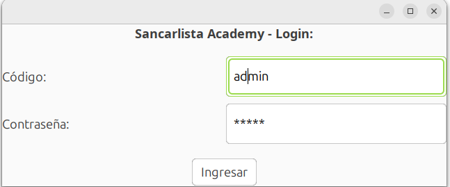
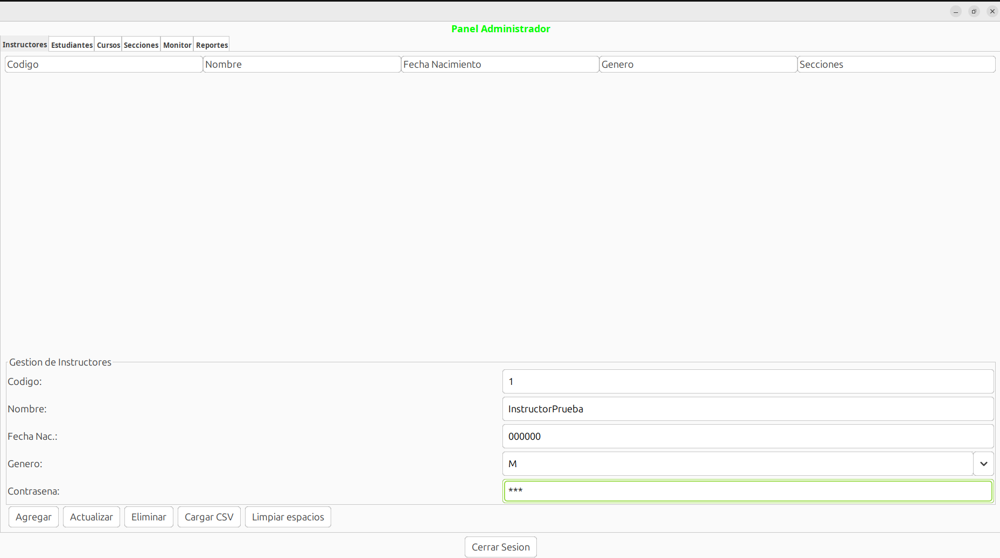
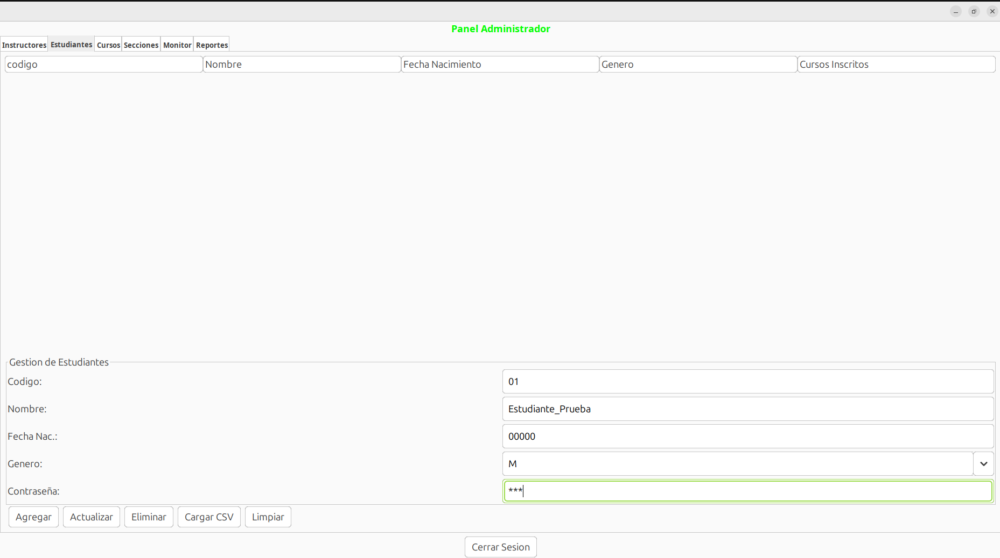
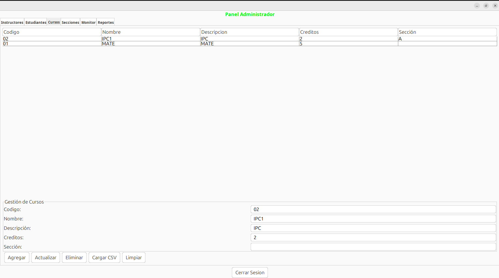
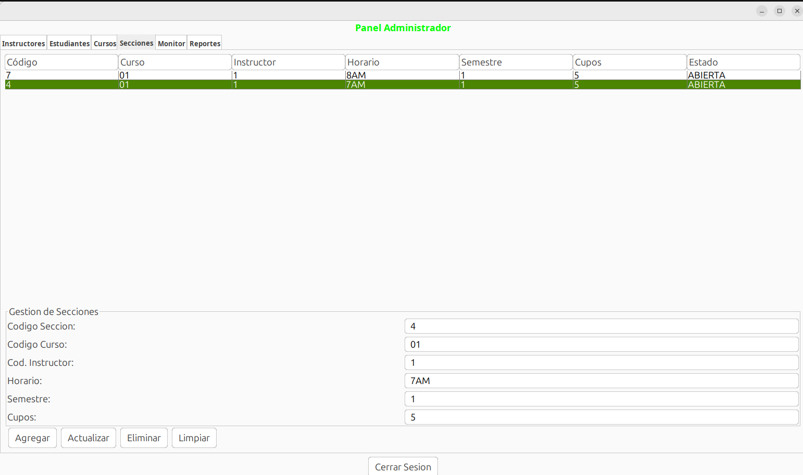
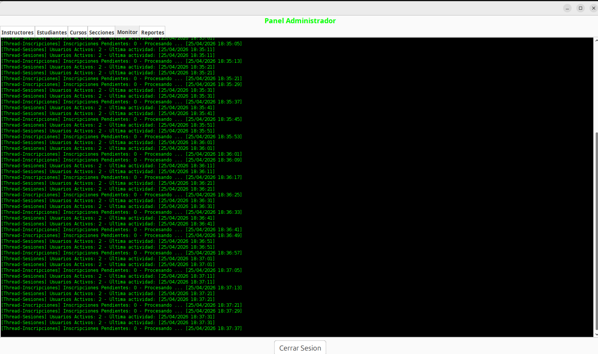
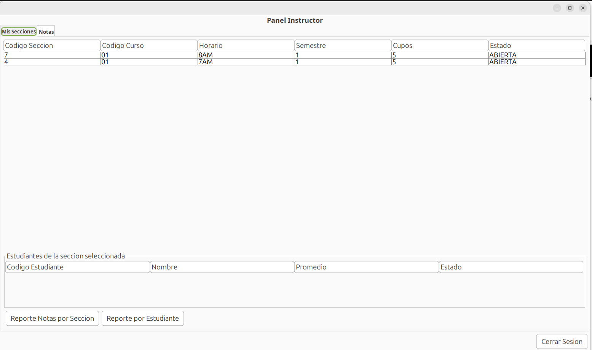
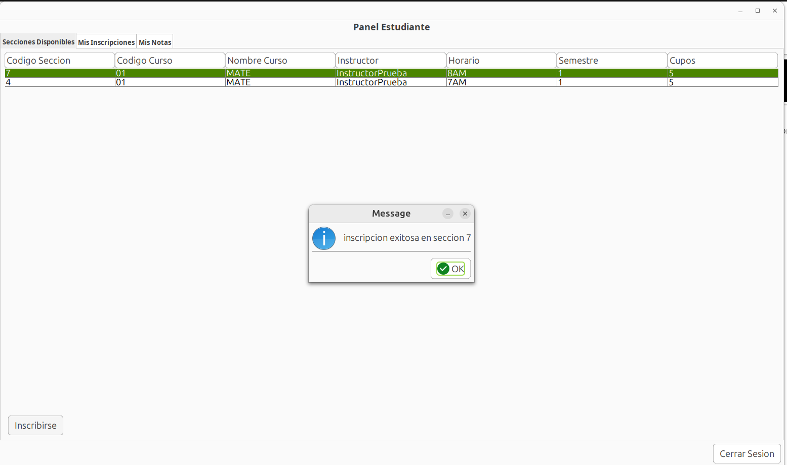
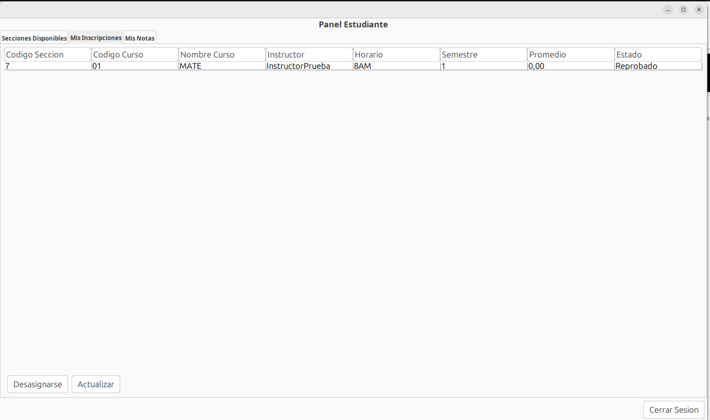
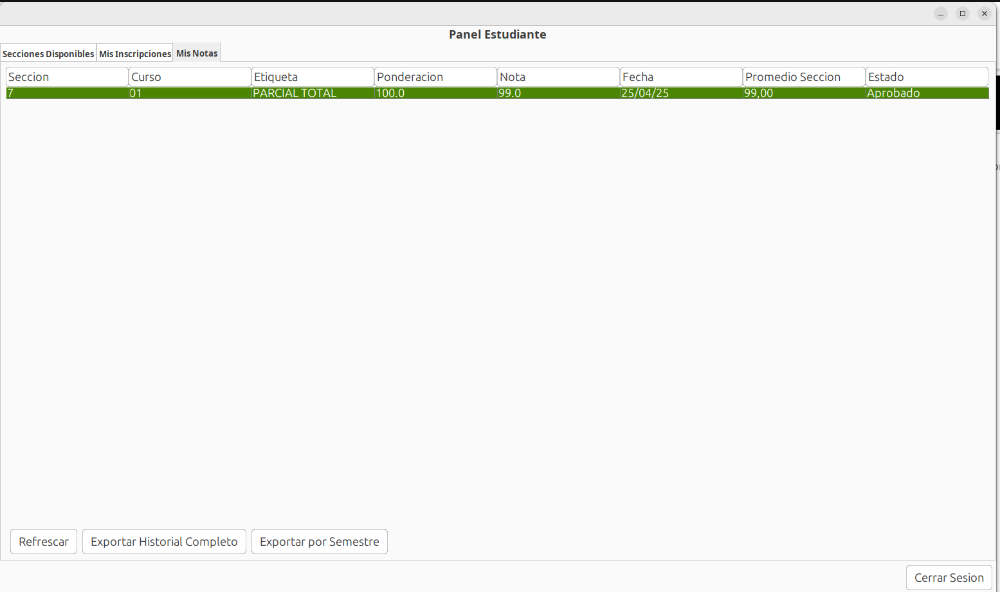

# Manual de Usuario — Sancarlista Academy
**Curso:** Introduccion a la Programacion y Computacion 1 — USAC
**Lenguaje:** Java | **IDE:** NetBeans | **Patron:** MVC

---

**Estudiante:** Osmar Alejandro Alay Quevedo
**Carne:** 202100024
**Seccion:** B
**Fecha:** 25/04/2026

---

## 1. Descripcion del Sistema

Sancarlista Academy es una aplicacion de gestion academica con tres roles: Administrador, Instructor y Estudiante. Cada rol accede a funcionalidades distintas segun sus permisos.

---

## 2. Inicio de Sesion

Para ingresar al sistema ingrese su codigo de usuario y contrasena, luego haga clic en **Ingresar**. El sistema redirige automaticamente al panel correspondiente segun el rol. Si las credenciales son incorrectas, aparece un mensaje de error.

Credenciales del administrador por defecto:
- Codigo: `admin`
- Contrasena: `IPC1B`

---

## 3. Panel Administrador

### 3.1 Gestion de Instructores

Muestra la lista de instructores registrados en la tabla superior. Para operar:

- **Agregar:** Complete todos los campos del formulario (Codigo, Nombre, Fecha, Genero, Contrasena) y presione **Agregar**. El codigo debe ser unico.
- **Actualizar:** Haga clic en un instructor de la tabla para cargar sus datos en el formulario, modifique nombre o contrasena y presione **Actualizar**.
- **Eliminar:** Seleccione un instructor de la tabla y presione **Eliminar**.
- **Cargar CSV:** Permite cargar multiples instructores desde un archivo CSV con el formato: `Codigo, Nombre, FechaNacimiento, Genero, Contrasena`.
- **Limpiar espacios:** Limpia todos los campos del formulario.

### 3.2 Gestion de Estudiantes

Funciona igual que la gestion de instructores. La tabla muestra el codigo, nombre, fecha de nacimiento, genero y cantidad de cursos inscritos de cada estudiante.

- **Agregar / Actualizar / Eliminar:** Mismo proceso que instructores.
- **Cargar CSV:** Formato identico al de instructores.

### 3.3 Gestion de Cursos

Permite manejar el catalogo de cursos disponibles en la plataforma.

- **Agregar:** Ingrese Codigo, Nombre, Descripcion, Creditos y Seccion. Los creditos deben ser un numero entero.
- **Actualizar:** Seleccione un curso de la tabla, modifique los campos deseados y presione **Actualizar**.
- **Eliminar:** Seleccione un curso y presione **Eliminar**.
- **Cargar CSV:** Formato: `Codigo, NombreCurso, Descripcion, Creditos, Seccion`.

### 3.4 Gestion de Secciones

Las secciones vinculan un curso con un instructor y tienen cupos disponibles.

- **Agregar:** Ingrese Codigo de Seccion, Codigo de Curso (debe existir), Codigo de Instructor (debe existir), Horario, Semestre y Cupos. Si no ingresa cupos, el valor por defecto es 30.
- **Actualizar:** Seleccione una seccion y modifique instructor, horario, semestre o cupos.
- **Eliminar:** Seleccione una seccion y presione **Eliminar**.

### 3.5 Monitor de Hilos

Consola en tiempo real que muestra tres procesos ejecutandose en segundo plano:

- `[Thread-Sesiones]` — actualiza cada 10 segundos con la cantidad de usuarios activos.
- `[Thread-Inscripciones]` — actualiza cada 8 segundos con inscripciones pendientes en cola.
- `[Thread-Estadisticas]` — actualiza cada 15 segundos con cursos, estudiantes y notas registradas.

Los hilos inician automaticamente al entrar al panel y se detienen al cerrar sesion.

### 3.6 Reportes

Genera reportes en PDF y CSV simultaneamente en la carpeta del proyecto. El nombre del archivo incluye la fecha y hora de generacion.

- **Inscripciones por Curso:** Muestra cada curso con sus secciones abiertas y total de inscritos.
- **Inscripciones por Semestre:** Solicita el semestre (1 o 2) y lista las secciones de ese periodo.
- **Historial de Estudiante:** Solicita el codigo del estudiante y genera su historial academico completo.
- **Notas por Seccion:** Solicita el codigo de la seccion y lista todas las notas con promedios.
- **Reporte Bitacora:** Exporta el registro completo de actividades del sistema.

---

## 4. Panel Instructor

### 4.1 Mis Secciones

Muestra unicamente las secciones asignadas al instructor que inicio sesion. Al hacer clic en una seccion, la tabla inferior muestra los estudiantes inscritos con su promedio actual y estado (Aprobado/Reprobado).

- **Reporte Notas por Seccion:** Ingrese el codigo de la seccion para generar el reporte de calificaciones.
- **Reporte por Estudiante:** Ingrese el codigo del estudiante para generar su historial individual.

### 4.2 Notas

Muestra todas las notas de las secciones asignadas al instructor.

- **Agregar:** Complete Codigo de Curso, Seccion, Estudiante, Etiqueta (ej: Parcial1), Ponderacion (%), Nota (0-100) y Fecha. El sistema valida que el instructor tenga la seccion asignada y que el estudiante este inscrito.
- **Actualizar:** Seleccione una nota de la tabla, modifique ponderacion o valor y presione **Actualizar**.
- **Eliminar:** Seleccione una nota y presione **Eliminar**. El promedio se recalcula automaticamente.
- **Cargar CSV:** Carga notas masivamente. Formato: `CodigoCurso, CodigoSeccion, CodigoEstudiante, Etiqueta, Ponderacion, Nota, Fecha`.
- **Limpiar:** Limpia el formulario y deselecciona la tabla.

---

## 5. Panel Estudiante

### 5.1 Secciones Disponibles

Lista todas las secciones con estado ABIERTA y cupos disponibles. Muestra el nombre del curso, instructor asignado, horario, semestre y cupos restantes.

- **Inscribirse:** Seleccione una seccion de la tabla y presione **Inscribirse**. El sistema valida que no este ya inscrito y que haya cupos disponibles.

### 5.2 Mis Inscripciones

Muestra las secciones en las que el estudiante ya esta inscrito, con el promedio actual y estado de aprobacion en cada una.

- **Desasignarse:** Seleccione una seccion y presione **Desasignarse**. Solo es posible si no tiene notas registradas en esa seccion.
- **Actualizar:** Refresca la tabla con los datos mas recientes.

### 5.3 Mis Notas

Muestra todas las notas individuales del estudiante con el promedio ponderado calculado por seccion y el estado (Aprobado si promedio >= 61, Reprobado si es menor).

- **Refrescar:** Actualiza la tabla.
- **Exportar Historial Completo:** Genera PDF y CSV con todas las secciones y promedios del estudiante.
- **Exportar por Semestre:** Solicita el semestre (1 o 2) y genera el reporte filtrado por ese periodo.

---

## 6. Cerrar Sesion

El boton **Cerrar Sesion** esta disponible en todos los paneles. Al presionarlo, el sistema detiene los hilos activos (en el caso del administrador), registra el evento en la bitacora y regresa a la pantalla de login.

---

## 7. Archivos generados por el sistema

El sistema crea automaticamente los siguientes archivos en la carpeta raiz del proyecto:

| Archivo | Contenido |
|---------|-----------|
| `usuarios.ser` | Instructores, estudiantes y administrador |
| `cursos.ser` | Catalogo de cursos |
| `secciones.ser` | Secciones con estudiantes inscritos |
| `notas.ser` | Calificaciones registradas |
| `bitacora.txt` | Registro de todas las acciones del sistema |
| `*.pdf` / `*.csv` | Reportes generados con fecha y hora en el nombre |

Estos archivos se cargan automaticamente al iniciar el sistema, por lo que los datos persisten entre sesiones.
